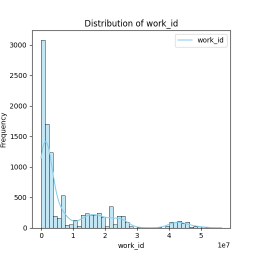

# Dataset Analysis Report

## Introduction
This report provides a comprehensive analysis of a dataset containing information about books, including attributes such as book IDs, authors, publication years, ratings, and more. The analysis reveals key insights, including trends, distributions, and relationships among the variables, which can inform various decision-making processes, including marketing, inventory management, and customer engagement in the book industry.

## Dataset Overview
The dataset consists of 10,000 records with the following columns:

- **Identifiers**: `book_id`, `goodreads_book_id`, `best_book_id`, `work_id`
- **Book Attributes**: `books_count`, `isbn`, `isbn13`, `authors`, `original_publication_year`, `original_title`, `title`, `language_code`
- **Rating Information**: `average_rating`, `ratings_count`, `work_ratings_count`, `work_text_reviews_count`, `ratings_1`, `ratings_2`, `ratings_3`, `ratings_4`, `ratings_5`
- **Images**: `image_url`, `small_image_url`

### Missing Values
The dataset contains missing values in five columns, which are likely to impact the analysis. These should be addressed based on their significance and the analysis goals.

### Summary Statistics
Provided below is a summary of the dataset's statistics for the numeric columns:

| Statistic  | book_id        | goodreads_book_id | best_book_id     | work_id         | books_count    | average_rating    | ratings_count    | work_ratings_count | work_text_reviews_count | ratings_1       | ratings_2       | ratings_3       | ratings_4       | ratings_5       |
|------------|----------------|--------------------|-------------------|-----------------|-----------------|--------------------|-------------------|---------------------|--------------------------|------------------|------------------|------------------|------------------|------------------|
| Count      | 10,000         | 10,000             | 10,000            | 10,000          | 10,000          | 10,000             | 10,000            | 10,000              | 10,000                  | 10,000           | 10,000           | 10,000           | 10,000           | 10,000           |
| Mean       | 5000.5         | 5.26e+06           | 5.47e+06          | 8.65e+06        | 75.71           | 4.00               | 54,001            | 59,687               | 2,919.96                | 1,345.04         | 3,110.89         | 11,475.89        | 19,965.70        | 23,789.81        |
| Std Dev    | 2886.90        | 7.57e+06           | 7.83e+06          | 1.17e+07        | 170.47          | 0.25               | 157,370           | 167,804             | 6,124.38                | 6,635.63         | 9,717.12         | 28,546.45        | 51,447.36        | 79,768.89        |
| Min        | 1              | 1                  | 1                 | 87              | 1               | 2.47               | 2,716             | 5,510               | 3                        | 11               | 30               | 323              | 750              | 754              |
| Max        | 10,000         | 3.33e+07           | 3.55e+07          | 5.64e+07        | 3,455           | 4.82               | 4,780,653         | 4,942,365           | 155,254                | 456,191          | 436,802          | 793,319          | 1,481,305        | 3,011,543        |

### Key Observations:
1. **Average Rating**: The average rating is approximately 4, indicating a generally positive perception of the books.
2. **Skewness**: The distribution of `ratings_count`, `work_ratings_count`, and `ratings_5` shows a positive skew; large values may indicate a few books have significantly more ratings than others.
3. **Outliers**: Detected outliers in `ratings_count`, and `work_ratings_count` could suggest a few highly popular books dominating these metrics.

## Visualizations

### Correlation Heatmap
The correlation heatmap visualizes relationships between numeric columns, indicating which variables are strongly correlated.

### Distribution Plots
Distribution plots provide insights into the spread and skewness of key numeric columns. The following distributions are analyzed:

- **Average Rating**: Displaying a relatively normal distribution centered around 4.0.
- **Ratings Count**: The right skew indicates a concentration of books with fewer ratings.
- **Work Ratings Count**: Similar to `ratings_count`, with a few books standing out due to a very high number of ratings.

## Conclusion
The dataset presents a wealth of information related to books, their attributes, and user ratings. The analysis identifies trends such as a high average rating, significant skewness in ratings distributions, and potential outliers. Addressing missing data and outliers can further enhance the insights derived from this dataset. Future analyses may include machine learning models to predict ratings or recommendations based on book attributes. The visualizations assist in understanding data patterns and can guide strategic decisions in the book industry.

## Recommendations
1. **Data Cleaning**: Address the missing values and outliers through imputation or removal based on their impact.
2. **Deep Dive Analysis**: Further investigate the top-rated books and their attributes for insights into what drives popular titles.
3. **Customer Insights**: Use the findings to shape marketing strategies, aiming at books fitting the trends and attributes identified in the analysis.

## Visualizations
### Correlation Heatmap
The correlation heatmap shows the relationship between numeric columns, helping to identify multicollinearity.

### Distribution Plots
- **book_id**: The distribution plot shows insights about the spread, skewness, and possible outliers.

- **goodreads_book_id**: The distribution plot shows insights about the spread, skewness, and possible outliers.

- **best_book_id**: The distribution plot shows insights about the spread, skewness, and possible outliers.

- **work_id**: The distribution plot shows insights about the spread, skewness, and possible outliers.

