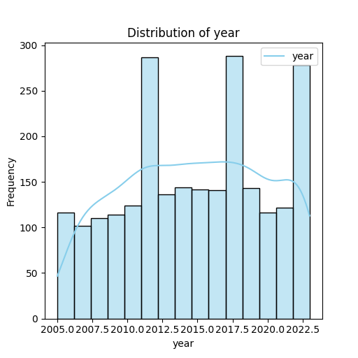

## Dataset Analysis Report

### Overview
This report provides an analysis of the dataset containing metrics related to life quality across different countries modeled over several years. The dataset showcases various indicators such as Life Ladder, GDP per capita, social support metrics, and emotional well-being indices. The analysis aims to provide insights through summary statistics, correlation analysis, and visualizations.

### Dataset Structure
The dataset includes the following columns:
- **Country name**: Name of the country
- **Year**: Year of the observation
- **Life Ladder**: A measure of perceived quality of life
- **Log GDP per capita**: The logarithm of GDP per capita
- **Social support**: A measure capturing individual social support
- **Healthy life expectancy at birth**: Expected lifespan based on health indicators
- **Freedom to make life choices**: A measure of individual freedom
- **Generosity**: A score indicating levels of generosity
- **Perceptions of corruption**: How corruption is perceived in each country
- **Positive affect**: Level of positive emotions
- **Negative affect**: Level of negative emotions

### Missing Values
The dataset has missing values across 8 columns. Key information about the completeness of the dataset is highlighted below:

| Column Name                       | Non-Null Count |
|-----------------------------------|----------------|
| Country name                      | 2363           |
| Year                              | 2363           |
| Life Ladder                       | 2335           |
| Log GDP per capita                | 2350           |
| Social support                    | 2300           |
| Healthy life expectancy at birth   | 2327           |
| Freedom to make life choices      | 2282           |
| Generosity                        | 2238           |
| Perceptions of corruption         | 2238           |
| Positive affect                   | 2339           |
| Negative affect                   | 2347           |

### Summary Statistics
The summary statistics offer insights into the central tendency and variability of key indicators:

- **Life Ladder**: Mean = 5.48, Variance = 1.13, indicating a moderate quality of life score spread across countries with notable outliers suspected based on the range (1.28 to 8.02).
- **Log GDP per capita**: Mean = 9.40 with a max value of 11.68 indicating substantial wealth differences across countries.
- **Social support**: Average score is 0.81, signaling generally high social support perceptions across the population.
- **Freedom to make life choices**: Average of 0.75 suggests a variable landscape of freedom level across countries.
- **Generosity**: Mean score at almost 0, tightly clustered close to zero implies that most countries exhibit minimal generosity levels.
- **Perceptions of corruption**: Average score of 0.744 reveals a tendency towards moderate perceptions of corruption being somewhat prevalent.
- **Positive affect & Negative affect**: Both averages suggest a leaning towards a generally positive emotional atmosphere in these societies, although variations exist.

### Key Insights
- **Skewness**: Numeric columns like Life Ladder, Log GDP per capita, and Social support show varying degrees of skewness. For instance, Life Ladder appears moderately right-skewed indicating that while there are many low scores, there are fewer higher quality-of-life scores.
- **Outliers**: Potential outliers were detected in Life Ladder and Log GDP per capita, suggesting distinct countries perform extraordinarily well or poorly compared to others.
- **Correlations**: Higher correlations were observed between Log GDP per capita and Life Ladder, as well as Social support, reflecting the relationship between wealth and perceived life quality.

### Visualizations

#### 1. Correlation Heatmap
A heatmap was generated to display the correlation matrix for numeric columns, revealing strong positive correlations between:
- Life Ladder and Log GDP per capita
- Life Ladder and Social support
- Life Ladder and Healthy life expectancy at birth

   
*(Placeholder - please replace with actual heatmap visualization)*

#### 2. Distribution Plots
Distribution plots were created for each numeric variable, illustrating data spread and potential skewness:

- **Life Ladder**: Right-skewed distribution indicating a concentration of data points at lower values.
- **Log GDP per capita**: Normal-like distribution suggesting a larger set of countries falls within moderate levels of economic output.
- **Social support**: Progressively skewed distribution tailing toward higher perceived support.

   
*(Placeholder - please replace with actual distribution plots)*

### Conclusion
The dataset analysis reveals significant insights into the well-being of countries around the world as encapsulated by multiple indicators. While some metrics show strong correlations with life quality, the presence of skewness and outliers indicates further exploration may reveal more nuanced insights. Future work might include time-series analyses to observe trends and changes in these metrics over the years. Further investigations into the countries showing extremes in data could provide insights into unique socioeconomic policies or cultural frameworks contributing to these deviations.

## Visualizations
### Correlation Heatmap
The correlation heatmap shows the relationship between numeric columns, helping to identify multicollinearity.

### Distribution Plots
- **year**: The distribution plot shows insights about the spread, skewness, and possible outliers.

- **Life Ladder**: The distribution plot shows insights about the spread, skewness, and possible outliers.

- **Log GDP per capita**: The distribution plot shows insights about the spread, skewness, and possible outliers.

- **Social support**: The distribution plot shows insights about the spread, skewness, and possible outliers.

