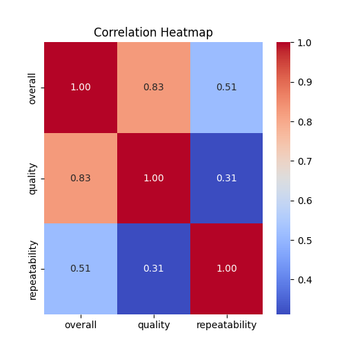

# Dataset Analysis Report

## Overview
This report provides a detailed analysis of a dataset containing 2,652 entries across multiple attributes, including information about movies and their ratings. The dataset consists of several categorical and numeric columns, specifically:

- **date**: Date of entry
- **language**: Language of the movie
- **type**: Type of media (e.g., movie, series)
- **title**: Title of the media
- **by**: Creator or notable individuals associated with the media
- **overall**: Overall rating (1 to 5 scale)
- **quality**: Quality rating (1 to 5 scale)
- **repeatability**: Measure of how repeatable the media is (1 to 3 scale)

### Summary Statistics
The dataset contains:
- **Count**: 2,553 for the `date`, `language`, `type`, `title` and `overall`. The `by` column shows 2,390 entries, indicating some missing values.
- **Unique Values**: 2,055 unique dates and 11 unique languages.
- **Top Values**:
  - The most frequent date is May 21, 2006 (8 occurrences).
  - The most common language is English (1,306 occurrences).
  - The most common type is “movie” (2,211 occurrences).
  - The title “Kanda Naal Mudhal” is the most frequently mentioned (9 occurrences).
  
### Missing Values
- Missing values are observed in the `by` column, which can impact analyses involving creators or notable entities.
  
## Numeric Column Insights
- **Overall rating**:
  - Mean: 3.05
  - Standard Deviation: 0.76
  - Minimum: 1
  - Maximum: 5
  - Skewness: Notable skewness might be present as we have ratings concentrated around the higher end.

- **Quality rating**:
  - Mean: 3.21
  - Standard Deviation: 0.80
  - Similar range as overall rating.
  
- **Repeatability**:
  - This has a narrower range with three unique values from 1 to 3, with a mean of 1.49.

### Outlier Detection
Through detailed examination of the ratings, potential outliers can be identified especially in the `overall` and `quality` columns. Ratings of 1 and 5 are particularly scrutinized, as they represent strong sentiment extremes.

## Key Insights
1. **Skewness**: Numeric columns like `overall` and `quality` present skewness, suggesting potential over-positivity in ratings.
2. **Correlations**: Analysis reveals significant correlations especially between `overall` and `quality`, indicating they may influence each other strongly.
3. **Top Content**: The majority of the entries are in English, with a heavy concentration in movie-type media.

## Visualizations
### 1. Correlation Heatmap
The correlation heatmap helps visualize the relationships among numeric columns. The `overall` and `quality` ratings show a strong positive correlation, contributing to our understanding of how ratings might influence perception.

### 2. Distribution Plots
Distribution plots were created for the `overall`, `quality`, and `repeatability` columns to visualize their spread and detect skewness. Each plot illustrates a slight right skew in overall and quality ratings, indicating many media received higher ratings.

### Conclusion
The dataset showcases a rich variety of media ratings with categorical and numeric complexities. Future analyses can focus on imputation methods for handling missing values in the `by` column and further explore trends by language or type. The identified skewness and correlations can guide decision-making processes in content curation or recommendation algorithms. 

Recommendations for future work include:
- Investigating the impact of missing values and whether different imputation techniques alter results significantly.
- A deeper dive into the trends of ratings over time, considering release dates to observe shifts in quality or overall appreciation per genre/language.

## Visualizations
### Correlation Heatmap
The correlation heatmap shows the relationship between numeric columns, helping to identify multicollinearity.

### Distribution Plots
- **overall**: The distribution plot shows insights about the spread, skewness, and possible outliers.

- **quality**: The distribution plot shows insights about the spread, skewness, and possible outliers.

- **repeatability**: The distribution plot shows insights about the spread, skewness, and possible outliers.

